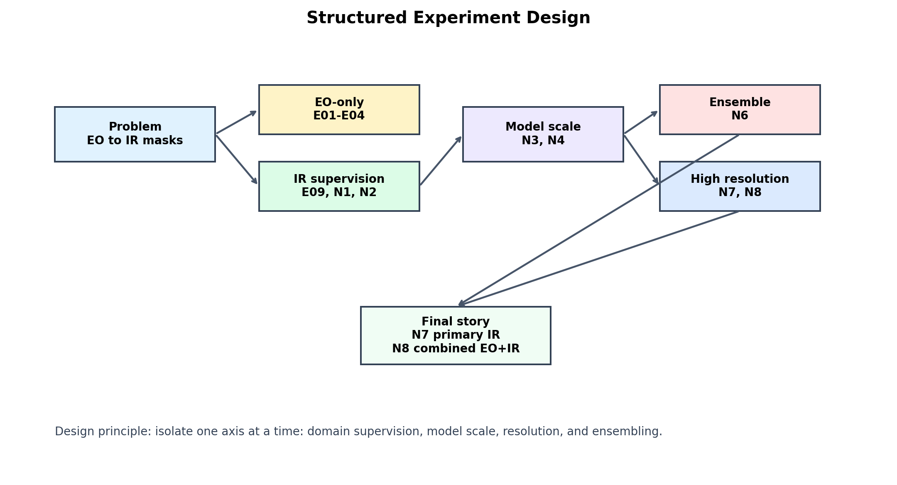
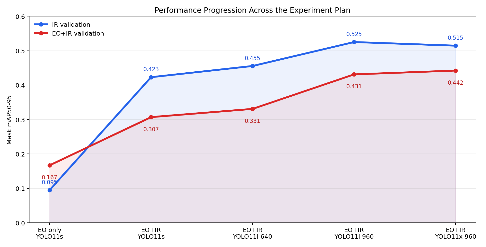
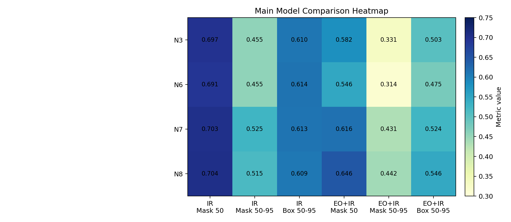
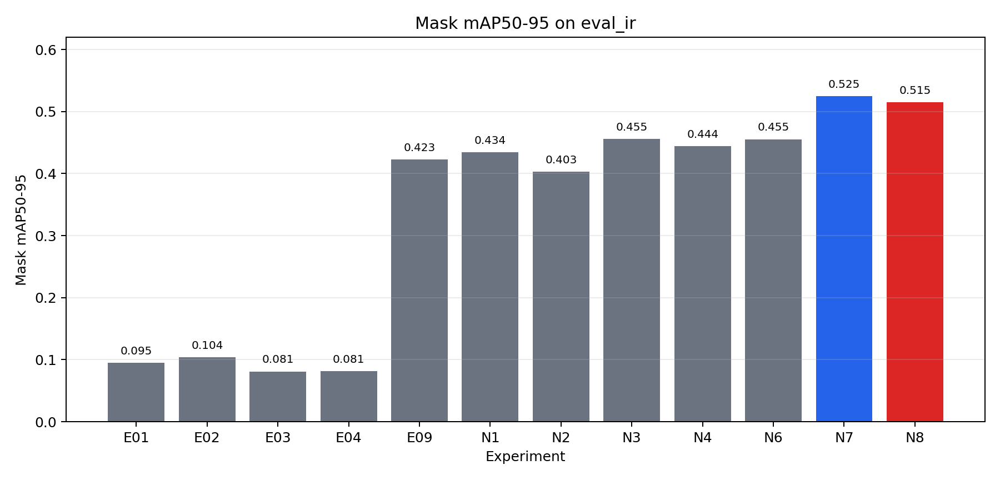
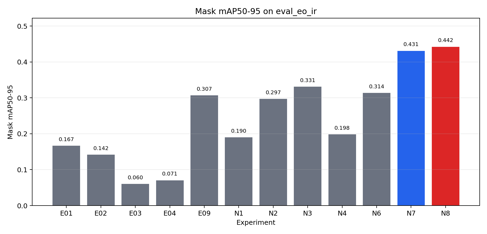

# EO/IR Aerial Image Segmentation: Experimental Study

Technical summary for MTech dissertation and research paper planning.

Date: 2026-06-09  
Repository: `domain-adaptation-segmentation`  
Task: YOLO-based object segmentation in electro-optical (EO) and infrared (IR) aerial imagery

---

## Index

- [1. Executive Summary](#1-executive-summary)
- [2. Problem Statement](#2-problem-statement)
- [3. Dataset and Evaluation Setup](#3-dataset-and-evaluation-setup)
- [4. Structured Experiment Design](#4-structured-experiment-design)
- [5. Experiment Inventory](#5-experiment-inventory)
- [6. Performance Progression](#6-performance-progression)
- [7. Main Comparison](#7-main-comparison)
- [8. Full Quantitative Results](#8-full-quantitative-results)
  - [8.1 IR-only validation](#81-ir-only-validation-eval_ir)
  - [8.2 Combined EO+IR validation](#82-combined-eoir-validation-eval_eo_ir)
- [9. Scientific Interpretation](#9-scientific-interpretation)
  - [9.1 EO-only adaptation was not sufficient](#91-eo-only-adaptation-was-not-sufficient)
  - [9.2 IR supervision is the dominant factor](#92-ir-supervision-is-the-dominant-factor)
  - [9.3 Model scale helps, but not alone](#93-model-scale-helps-but-not-alone)
  - [9.4 Resolution is the cleanest improvement](#94-resolution-is-the-cleanest-improvement)
  - [9.5 YOLO11x improves combined evaluation, not primary IR strict masks](#95-yolo11x-improves-combined-evaluation-not-primary-ir-strict-masks)
  - [9.6 Ensembling did not beat high-resolution joint training](#96-ensembling-did-not-beat-high-resolution-joint-training)
- [10. Potential Thesis Contributions](#10-potential-thesis-contributions)
- [11. Paper Storyline](#11-paper-storyline)
- [12. Suggested Dissertation Chapter Mapping](#12-suggested-dissertation-chapter-mapping)
- [13. Limitations and Discussion](#13-limitations-and-discussion)
- [14. Open Technical Decisions](#14-open-technical-decisions)
- [15. Remaining Work Before Submission/Defense](#15-remaining-work-before-submissiondefense)
- [16. Artifacts Created](#16-artifacts-created)
- [17. Concise Summary](#17-concise-summary)

---

## 1. Executive Summary

This work studies how YOLO segmentation models behave when moving from EO imagery to IR imagery, and how performance changes when we introduce IR supervision, larger models, higher input resolution, and model ensembling.

The most important finding is:

- EO-only training and grayscale/domain-style augmentation are not enough for strong IR segmentation.
- Adding real IR supervision gives the largest jump.
- Increasing model size from YOLO11s to YOLO11l improves performance.
- Increasing input resolution from 640 to 960 gives the cleanest gain for primary IR mask quality.
- YOLO11x at 960 improves combined EO+IR evaluation, but does not replace YOLO11l at 960 on the primary IR strict mask metric.
- The model ensemble is useful as an ablation, but high-resolution joint training is stronger.

Current interpretation:

| Role | Best Experiment | Why |
|---|---|---|
| Best primary IR model | N7 | Highest IR mask mAP50-95: `0.5250` |
| Best combined EO+IR model | N8 | Highest EO+IR mask mAP50-95: `0.4422` |
| Best 640-resolution large baseline | N3 | Strong YOLO11l reference at 640 |
| Ensemble ablation | N6 | Shows naive mask-aware ensemble does not beat high-res joint training |

Central conclusion:

> The strongest dissertation result is not that grayscale augmentation alone solves EO-to-IR segmentation. The stronger and more defensible result is a controlled study showing that IR supervision, high-resolution training, and model capacity affect YOLO segmentation differently. N7 is best for primary IR strict mask quality, while N8 is best for combined EO+IR evaluation.

---

## 2. Problem Statement

The initial research direction was inspired by prior visible-to-thermal adaptation work for object detection. However, our dissertation focus is segmentation, not only bounding boxes. Segmentation is harder because the model must recover object boundaries and pixel-level object extent, not just object location.

The practical problem:

> Can we build a strong YOLO-based segmentation pipeline for EO/IR aerial imagery, and identify which training choices most improve IR-domain segmentation performance?

The study is framed around controlled experimentation rather than a single model claim.

---

## 3. Dataset and Evaluation Setup

Dataset source on Kaggle:

```text
ayushbpanchal/indraeye-seg
```

Kaggle mounted path:

```text
/kaggle/input/datasets/ayushbpanchal/indraeye-seg
```

Dataset structure:

```text
eo/
  images/train
  images/val
  labels/train
  labels/val
ir/
  images/train
  images/val
  labels/train
  labels/val
```

Class set:

| ID | Class |
|---:|---|
| 0 | Bicycle |
| 1 | Bus |
| 2 | Car |
| 3 | Cargo trike |
| 4 | Ignore |
| 5 | Motorcycle |
| 6 | Person |
| 7 | Rickshaw |
| 8 | Small truck |
| 9 | Tractor |
| 10 | Truck |
| 11 | Van |

Evaluation sets:

| Evaluation name | Meaning | Purpose |
|---|---|---|
| `eval_ir` | IR validation only | Primary metric for IR segmentation |
| `eval_eo_ir` | EO validation + IR validation | Measures combined-domain robustness |

Primary metric:

```text
Mask mAP50-95
```

Reason: mask mAP50-95 is stricter than mAP50 and better reflects boundary quality.

---

## 4. Structured Experiment Design

The experiments were designed to isolate one axis at a time:

1. EO-only and grayscale adaptation baselines.
2. Addition of real IR supervision.
3. Model scale increase.
4. Input resolution increase.
5. Ensembling.
6. Largest-model capacity test.



---

## 5. Experiment Inventory

| ID | Purpose | Model | Training Data | Resolution | Notes |
|---|---|---|---|---:|---|
| E01 | EO-only baseline | YOLO11s-seg | EO | 640 | Tests direct EO to IR transfer |
| E02 | Full grayscale EO | YOLO11s-seg | EO gray | 640 | Simple color-domain removal |
| E03 | Box-guided grayscale EO | YOLO11s-seg | EO box-gray | 640 | Detection-style object-region grayscale |
| E04 | Mask-guided grayscale EO | YOLO11s-seg | EO mask-gray | 640 | Segmentation-aware grayscale transform |
| E09 | Joint EO+IR baseline | YOLO11s-seg | EO+IR | 640 | First supervised mixed-domain diagnostic |
| N1 | IR-only supervised | YOLO11s-seg | IR | 640 | Target-domain supervised baseline |
| N2 | Balanced EO+IR | YOLO11s-seg | balanced EO+IR | 640 | Controls EO/IR data ratio |
| N3 | Large joint baseline | YOLO11l-seg | EO+IR | 640 | Large model at default resolution |
| N4 | Large IR specialist | YOLO11l-seg | IR | 640 | Specialist candidate for ensemble |
| N6 | N3+N4 ensemble | 2x YOLO11l-seg | EO+IR + IR | 640 | Mask-aware ensemble evaluation |
| N7 | High-resolution joint model | YOLO11l-seg | EO+IR | 960 | Best primary IR strict-mask result |
| N8 | High-resolution XL model | YOLO11x-seg | EO+IR | 960 | Best combined EO+IR result |

---

## 6. Performance Progression

The chart below shows the central story: performance improves sharply when IR supervision is introduced, then improves further with model scale and high-resolution training.



Key reading:

- E01 has weak IR mask mAP50-95: `0.0948`.
- E09 jumps to `0.4229` on IR due to EO+IR supervision.
- N3 improves to `0.4555` using YOLO11l.
- N7 improves to `0.5250` using YOLO11l at 960 resolution.
- N8 reaches `0.5145` on IR and `0.4422` on combined EO+IR.

---

## 7. Main Comparison

The table below summarizes the central quantitative comparison.

| ID | Method | Model | Eval | Mask mAP50 | Mask mAP50-95 | Box mAP50 | Box mAP50-95 |
|---|---|---|---|---:|---:|---:|---:|
| N3 | Joint EO+IR large | YOLO11l-seg | eval_ir | 0.6968 | 0.4555 | 0.7167 | 0.6099 |
| N6 | N3+N4 mask-aware ensemble | 2x YOLO11l-seg | eval_ir | 0.6910 | 0.4553 | 0.7171 | 0.6143 |
| N7 | Joint EO+IR high-res | YOLO11l-seg | eval_ir | 0.7025 | 0.5250 | 0.7192 | 0.6128 |
| N8 | Joint EO+IR high-res XL | YOLO11x-seg | eval_ir | 0.7041 | 0.5145 | 0.7205 | 0.6091 |
| N3 | Joint EO+IR large | YOLO11l-seg | eval_eo_ir | 0.5823 | 0.3308 | 0.6192 | 0.5025 |
| N6 | N3+N4 mask-aware ensemble | 2x YOLO11l-seg | eval_eo_ir | 0.5462 | 0.3139 | 0.5828 | 0.4749 |
| N7 | Joint EO+IR high-res | YOLO11l-seg | eval_eo_ir | 0.6163 | 0.4310 | 0.6383 | 0.5244 |
| N8 | Joint EO+IR high-res XL | YOLO11x-seg | eval_eo_ir | 0.6463 | 0.4422 | 0.6632 | 0.5455 |

Heatmap view:



---

## 8. Full Quantitative Results

### 8.1 IR-only validation (`eval_ir`)



| ID | Model | Training | Mask mAP50-95 | Interpretation |
|---|---|---|---:|---|
| E01 | YOLO11s | EO | 0.0948 | Weak direct EO to IR transfer |
| E02 | YOLO11s | EO gray | 0.1040 | Slightly better than EO-only, still weak |
| E03 | YOLO11s | EO box-gray | 0.0811 | Underperforms |
| E04 | YOLO11s | EO mask-gray | 0.0812 | Underperforms |
| E09 | YOLO11s | EO+IR | 0.4229 | Major gain from IR supervision |
| N1 | YOLO11s | IR | 0.4342 | Strong target-domain baseline |
| N2 | YOLO11s | balanced EO+IR | 0.4031 | Balanced data not better on IR-only |
| N3 | YOLO11l | EO+IR | 0.4555 | Model scale improves |
| N4 | YOLO11l | IR | 0.4438 | IR specialist, below N3 |
| N6 | 2x YOLO11l | ensemble | 0.4553 | Ensemble does not improve masks |
| N7 | YOLO11l | EO+IR 960 | **0.5250** | Best primary IR result |
| N8 | YOLO11x | EO+IR 960 | 0.5145 | Close to N7, but not better on strict IR masks |

### 8.2 Combined EO+IR validation (`eval_eo_ir`)



| ID | Model | Training | Mask mAP50-95 | Interpretation |
|---|---|---|---:|---|
| E01 | YOLO11s | EO | 0.1669 | EO validation helps combined score |
| E02 | YOLO11s | EO gray | 0.1417 | Below EO-only |
| E03 | YOLO11s | EO box-gray | 0.0605 | Poor |
| E04 | YOLO11s | EO mask-gray | 0.0705 | Poor |
| E09 | YOLO11s | EO+IR | 0.3069 | Strong mixed-domain baseline |
| N1 | YOLO11s | IR | 0.1902 | Poor combined because EO is unseen |
| N2 | YOLO11s | balanced EO+IR | 0.2969 | Close to E09 |
| N3 | YOLO11l | EO+IR | 0.3308 | Large model improves |
| N4 | YOLO11l | IR | 0.1984 | IR specialist lacks EO generality |
| N6 | 2x YOLO11l | ensemble | 0.3139 | Ensemble below N3 |
| N7 | YOLO11l | EO+IR 960 | 0.4310 | Strong high-resolution model |
| N8 | YOLO11x | EO+IR 960 | **0.4422** | Best combined EO+IR result |

---

## 9. Scientific Interpretation

### 9.1 EO-only adaptation was not sufficient

E01-E04 show that simple EO-only transformations do not solve the EO-to-IR gap for segmentation. Full grayscale, box-guided grayscale, and mask-guided grayscale do not approach the performance of supervised EO+IR training.

This is important because it prevents overclaiming. The final dissertation should clearly state that the strongest results come from **supervised mixed-domain segmentation**, not unsupervised domain adaptation.

### 9.2 IR supervision is the dominant factor

The jump from E01 to E09 is the largest early improvement:

```text
IR mask mAP50-95:
E01 = 0.0948
E09 = 0.4229
Gain = +0.3281
```

This shows that access to IR labels changes the problem dramatically.

### 9.3 Model scale helps, but not alone

N3 improves over E09 by moving from YOLO11s to YOLO11l:

```text
IR mask mAP50-95:
E09 = 0.4229
N3  = 0.4555
Gain = +0.0326
```

This is useful but smaller than the IR-supervision gain.

### 9.4 Resolution is the cleanest improvement

N7 keeps the model family at YOLO11l but increases input resolution from 640 to 960:

```text
IR mask mAP50-95:
N3 = 0.4555
N7 = 0.5250
Gain = +0.0696
```

This is one of the strongest publishable observations: for aerial EO/IR segmentation, higher input resolution substantially improves strict mask quality.

### 9.5 YOLO11x improves combined evaluation, not primary IR strict masks

N8 uses the largest model at the same high resolution:

```text
IR mask mAP50-95:
N7 = 0.5250
N8 = 0.5145

EO+IR mask mAP50-95:
N7 = 0.4310
N8 = 0.4422
```

Interpretation:

- N8 is better for combined EO+IR validation.
- N7 remains better for primary IR strict mask quality.
- N8 should be presented as a capacity-scaling ablation, not as an unconditional best model.

### 9.6 Ensembling did not beat high-resolution joint training

N6 combines N3 and N4 through mask-aware ensemble evaluation, but it does not beat N7:

```text
IR mask mAP50-95:
N6 = 0.4553
N7 = 0.5250
```

This suggests that better training configuration and resolution matter more than simple late-stage ensembling.

---

## 10. Potential Thesis Contributions

The thesis can be framed around the following contributions:

1. A reproducible YOLO segmentation benchmark for EO/IR aerial imagery.
2. A controlled study of EO-only, grayscale, supervised IR, mixed-domain, large-model, high-resolution, and ensemble settings.
3. Evidence that EO-only grayscale-style adaptation is insufficient for segmentation under the current dataset.
4. Evidence that supervised EO+IR training gives a large performance jump.
5. Evidence that high-resolution training improves strict mask quality more cleanly than simply increasing model size.
6. A practical recommendation: YOLO11l at 960 is the strongest primary IR model, while YOLO11x at 960 is useful for combined EO+IR performance.

---

## 11. Paper Storyline

Suggested paper framing:

> We present a controlled experimental study of YOLO-based segmentation for EO/IR aerial imagery. Starting from EO-only baselines and grayscale-domain transformations, we show that segmentation transfer to IR remains weak without IR supervision. We then quantify the impact of supervised mixed-domain training, model scaling, high-resolution training, and mask-aware ensembling. The results show that high-resolution YOLO11l provides the strongest primary IR mask quality, while YOLO11x improves combined EO+IR evaluation.

Possible title directions:

1. **A Controlled Study of YOLO-Based Segmentation for EO and Infrared Aerial Imagery**
2. **Resolution and Model Scaling for EO/IR Aerial Image Segmentation**
3. **From EO to Infrared: Experimental Analysis of YOLO Segmentation in Aerial Imagery**
4. **Mixed-Domain YOLO Segmentation for Electro-Optical and Infrared Aerial Imagery**

Avoid overclaiming:

- Do not call the final method unsupervised adaptation.
- Do not say grayscale augmentation solved the domain gap.
- Do not say YOLO11x is the overall best without specifying combined EO+IR evaluation.
- Do not claim N8 replaces N7 for primary IR strict-mask performance.

---

## 12. Suggested Dissertation Chapter Mapping

| Chapter | Content from this work |
|---|---|
| Introduction | EO/IR aerial segmentation motivation and problem statement |
| Literature Review | EO-to-IR domain shift, object detection adaptation, segmentation models, YOLO segmentation |
| Dataset and Methodology | Dataset structure, class mapping, train/eval protocol, metrics |
| Experimental Design | E01-E04, E09, N1-N8 experiment families |
| Results and Discussion | Tables, charts, key comparisons, interpretation |
| Conclusion | Best model choices, limitations, future work |

---

## 13. Limitations and Discussion

The following points should be stated transparently:

1. The strongest results use labeled IR data, so this is not fully unsupervised domain adaptation.
2. The EO-only grayscale experiments were weak, so the adaptation-style contribution is not the final strongest method.
3. N8 was expensive to train and required single-GPU execution because dual-GPU DDP failed for YOLO11x.
4. `full_n8_results.zip` had a malformed central directory for Python `zipfile`, although metrics/status were readable and recorded.
5. Qualitative N7-vs-N8 examples still need to be generated from full-run predictions.

---

## 14. Open Technical Decisions

The following points remain important for final dissertation and paper framing:

| Topic | Decision Needed | Why it matters |
|---|---|---|
| Paper positioning | Should we frame this as a controlled experimental study rather than a new adaptation algorithm? | This is the most honest framing because supervised EO+IR training gives the strongest results. |
| Main model claim | Should N7 be the headline model, with N8 as the capacity ablation? | N7 is best on primary IR mask mAP50-95, while N8 is best on combined EO+IR. |
| Evaluation priority | Should the dissertation prioritize `eval_ir` or `eval_eo_ir`? | The choice changes whether N7 or N8 is emphasized. |
| Qualitative results | Which classes/images should be selected for visual comparison? | Qualitative figures will strengthen the defense and paper. |
| Publication scope | Should the paper include all E01-E04 grayscale experiments or focus on N3/N6/N7/N8? | This affects paper length and clarity. |

Recommended framing:

> Use N7 as the primary IR segmentation result, use N8 as the largest-model combined-domain result, and present N6 as an ensemble ablation.

---

## 15. Remaining Work Before Submission/Defense

Recommended next steps:

1. Generate qualitative examples:
   - ground truth
   - N7 prediction
   - N8 prediction
   - same validation images where possible
2. Convert `main_comparison.csv` into a thesis-ready LaTeX table.
3. Prepare one slide with the performance progression chart.
4. Prepare one slide with the main heatmap.
5. Write the discussion around why resolution improved masks more cleanly than ensembling.

---

## 16. Artifacts Created

Final tables:

```text
reports/final/tables/final_metrics_long.csv
reports/final/tables/main_comparison.csv
```

Final result summary:

```text
reports/final/final_results_summary.md
```

Briefing assets:

```text
reports/guide_briefing/assets/experiment_design_map.png
reports/guide_briefing/assets/performance_progression.png
reports/guide_briefing/assets/main_comparison_heatmap.png
```

Final charts:

```text
reports/final/figures/mask_map50_95_eval_ir.png
reports/final/figures/mask_map50_95_eval_eo_ir.png
```

Reproducibility scripts:

```text
scripts/analysis/build_final_results.py
scripts/analysis/build_guide_briefing_assets.py
```

---

## 17. Concise Summary

We ran a structured set of YOLO segmentation experiments on EO/IR aerial data. EO-only and grayscale-style approaches were weak for IR masks. Adding IR supervision gave the main jump. YOLO11l improved over YOLO11s, and increasing resolution to 960 gave the best primary IR segmentation result. YOLO11x at 960 improved combined EO+IR evaluation but did not beat YOLO11l at 960 on the strict IR mask metric. Therefore, our main conclusion is that high-resolution mixed-domain YOLO segmentation is the strongest direction, with N7 as the primary IR model and N8 as a capacity-scaling/combined-domain ablation.
